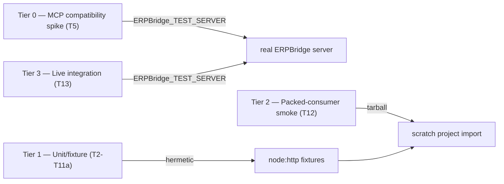

# Plan: SDK Testing & Self-Evolution

> Companion to `Plan.md`. Governs how the SDK's tests are run, what gets reported, and how this plan itself evolves from evidence. Scope: **the SDK only** (`erpbridge-sdk`) — unit/fixture suite, packed-consumer smoke, live integration, and package-shape checks. The ERPBridge server is a dependency of the live integration tier, not a reporting subject.

## Test tiers

## Report capture policy

- Every **saved** SDK test run produces a summarized, **agent-readable report — no large raw logs**.
- **The agent decides whether a run is worth writing down.** Expected TDD-red runs and routine green runs are usually skipped — do not save every successful run.
- An **expected TDD-red** is a newly added test that fails only because its implementation has not yet been written. It is neither a flake nor a hard-trigger failure.
- **Always save:** unexpected failures, flakes, new scenarios/coverage exercised, environment discoveries, and anything that changes the plan's picture. An unexpected failure or flake must be saved (hard rule — it feeds the evolution trigger).
- Saved to `.scratch/testing/` — a git repo whose contents are **never committed unless the user explicitly asks**.
- Never record token, cookie, credential, `Authorization`, or `WWW-Authenticate` header values. Sanitize commands, URLs, copied output, failure summaries, and manifest fields before saving.

## Report format

One markdown file per saved run + one valid JSON object per line in `index.jsonl`.

**File naming:** `YYYY-MM-DDTHHMMSSZ_<scope>_<topic>_<kind>.md` (UTC) — descriptive and collision-safe. Examples: `2026-08-20T143015Z_t13_sse-stall_issue.md`, `2026-08-20T143243Z_t12_subpath-imports_smoke.md`.

**Markdown summary fields:** date, task (`T#`, `Plan extension`, or `Unplanned investigation`), command, exit code, duration; tests pass / fail / expected-red / flake counts with failing test ids; gaps spotted / lessons (inline, concise).

**`index.jsonl` manifest:** one object per saved run — `{ date, task, command, exit, duration, failures[], flakes[], summary }` — for cross-run diffing. A **flake** is an unexpected failure that passes on an immediate rerun at the same revision with materially equivalent command and environment, or alternating outcomes across equivalent recorded runs. Record the retry command/result in the report; do not label a single failed run as a flake.

## Per-task execution

For every implementation task:

1. Run the focused test through TDD (expected red, then green).
2. Run the task's explicit `Verify:` command.
3. Run `npm test && npm run build` before marking the task complete.
4. Once the script exists, run `npm run lint:publish` for any task that produces or validates a consumable package artifact.

Tier commands are: fixture/unit coverage through `npm test`; the T5 compatibility spike through `ERPBridge_TEST_SERVER=<server-url> npm run test:mcp-compat`; T13 integration through `ERPBridge_TEST_SERVER=<server-url> npm run test:integration`; and T12 through its packed-consumer smoke script. Integration tests skip, rather than fail, when `ERPBridge_TEST_SERVER` is unset.

## Scratch folder (broader than testing)

`.scratch/` is the repo for anything **valid to future development** — uncommitted, descriptive file names:

- `testing/` — test reports (this plan, above)
- `research/` — research findings (e.g. `2026-08-20_mcp-v2_oauth-probe_research.md`)
- `decisions/` — major decisions (e.g. `2026-08-19_auth-deferral_decision.md`)
- `rca/` — bug root-cause analyses (e.g. `2026-08-18_cache-503_rca.md`)
- `summaries/` — session/project summaries

Trivia, one-off chatter, and anything not useful to future development stays out of `.scratch/`.

## Evolution loop (self-evolving)

The plan evolves from evidence, agent-assisted:

1. **Hard trigger** — an unexpected failed or flaky run amends this plan **before the next task starts**: append an Evolution Log entry with an inline summary of the scenario (its root cause or open RCA), a stable report identifier, and the plan change it implies. Expected TDD-red runs do not trigger this step. If the finding requires code, test, or documentation work outside the active task, add or extend an ordered `Plan.md` task with a `Verify:` command before implementing it; testing-policy-only changes amend this plan. The resulting work follows the one-task/one-commit rule. Inline summaries only — no Markdown file links.
2. **Session-start scan** — at the start of each working session, scan reports since the last completed scan or milestone (`index.jsonl` + markdown) against this plan: unexercised scenarios, repeated flakes, drift between fixture and reality, and coverage the plan claims but no report evidences. Track the scan cursor in ignored `.scratch/testing/review-state.json` (`lastScannedAt`, last report identifier). Amendments go to the Evolution Log; record a no-amendment scan only in the scratch state.
3. **Milestones** (packed-consumer smoke and releases) — pass over all reports since the last milestone; findings that require implementation become ordered `Plan.md` tasks before work begins.

## Evolution Log

> Entries are appended here as the plan evolves — start empty. Include `Evidence: <report filename>` without a Markdown link so each conclusion remains traceable.

2026-08-23 — R9 publish-gate execution hit the known sandbox restriction on the nested npm pack subprocess; build, attw, and publint passed before the pack step. The approved elevated retry is required for this environment and does not change the product plan. Evidence: 2026-08-23T111853Z_R9_publish-gate_sandbox-failure.md
